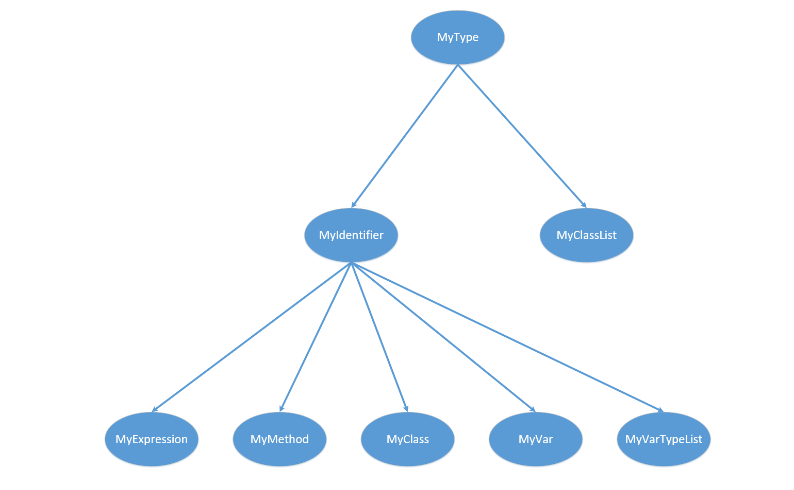

## 1. TypeChecker

+ [总目录](../README.md)

---

[TOC]


### 1.1 主要工作

+ 保证输入符合 `minijava`  的文法
+ `minijava` 的  `BNF` 见 [网站](http://compilers.cs.ucla.edu/cs132/project/piglet.html)

#### 1.1.1 要求检查的错误

+ 使用未定义的类、方法和变量
+ 重复定义类、方法和变量（注意作用域）
+ 类型不匹配
  + `if`、`while` 的判断表达式必须是 `boolean` 型
  + `Print` 参数必须为整数
  + 数组下标必须是 `int` 型
  + 赋值表达式左右操作数类型匹配
    + 右操作数的类型可以是左操作数的类型或者是左操作数类型的子类
+ 参数不匹配
  + 类型、个数、`return` 语句返回类型
    + `return` 返回类型的匹配可以视作是一个赋值
  + 不允许重载 (子类重载父类也不对)
+ 操作数相关
  + `+`、`*`、`<`  等操作数须为整数
+ 类的循环继承

#### 1.1.2 其他情况的判断

+ 允许函数名和变量名相同
+ 允许覆盖
  + 声明必须完全一致, 包括返回值
+ 函数的调用
  + 可能调用父类函数
+ 变量声明时 : 检查变量重定义(无关顺序)
  + 函数内局部声明
  + 函数列表声明

+ 变量使用时 ：检查是否声明 (注意顺序)
  + 函数内局部声明
  + 函数参数列表声明
  + 父类声明(父类递归向上检查)
+ 继承自身为错误

### 1.2 方法与设计

#### 1.2.1 生成语法树类文件和词法语法分析器

+ 使用 `JAVACC` 和 `JTB`

  ```shell
  java -jar jtb132.jar  minijava.jj
  java javacc jtb.out.jj
  ```

#### 1.2.2 类设计

##### 1.2.2.1 语法分析树中的类

+ 继承关系如下



###### MyType

+ `MyType`  作为所有类的基类，用于所有 `visitor` 的参数传递

```java
public class MyType {
    private String name;
    private int col;
    private int row;
    ······
}
```

###### MyIdentifier

+ `MyIdentifier` 用于获取一个 `Id(String)`

```java
public class MyIdentifier extends MyType {
    // 变量列表(MyClass/MyMethod)
    // 由于规定所有的变量声明必须在所有的变量使用前HashMap就够了)
    // 这么设置会导致 MyVar 的空间变大(MyMethod/MyClass)
    private HashMap<String, MyVar> localVarList = new HashMap<>();
    // 父结点(MyVar/MyMethod)
    private MyIdentifier parent;
    ······
}
```

###### MyVar

+ `Myvar` 用于保存变量信息

```java
public class MyVar extends MyIdentifier{
    // 记录变量的类型
    private String type;
    ······
}
```

###### MyClass

+ `MyClass` 用于保存类信息

```java
public class MyClass extends MyIdentifier{
    // 包括:函数列表(不允许重载), 继承类
    private HashMap<String, MyMethod> methodList = new HashMap<>();
    // 继承的父类名称
    private String extendsClassName;
    ······
}
```

###### MyMethod

+ `MyMethod` 用于保存函数信息

```java
// 方法类
public class MyMethod extends MyIdentifier{
    // 包括返回值类型, 变量列表, 参数列表
    private String returnType;
    // 参数列表
    private HashMap <String, MyVar> parameterList = new HashMap<>();
    // 参数类型列表
    private ArrayList<String> parameterTypeList = new ArrayList<>();
    ······
}
```

###### MyVarTypeList

+ 用于保存一组变量的类型
    + 在参数传递的过程中用到，用于参数匹配

```java
public class MyVarTypeList extends MyType{
    private ArrayList<String> varTypeList = new ArrayList<>();
    ······
}
```

###### MyClassList

+ 用于保存已经定义的所有类信息

```java
public class MyClassList extends MyType{
    // 没有顺序要求
    private HashMap<String, MyClass> classList = new HashMap<>();
    ······
}
```

###### MyExpression

+ 在 `TypeCheckerVisitor` 中判定类型匹配是使用到
+ 将 `MyType` 中的字段 `name` 使用为 `type`

```java
public class MyExpression extends MyType{
    // name 表示变量的类型
    ······
}
```

##### 1.2.2.2 其他类设计

###### Global

+ 静态类，用于保存一些需要多次传递的全局变量以及一些函数

```java
public class Global {
    public static MyClassList allClass;
    // check 调用时生成,类列表
    private static ArrayList<String> typeList;
    ······
}
```

###### ErrorPrinter

+ 静态类，用于输出错误信息

##### 1.2.2.3 visitor

###### BuildSymbolTableVisitor

+ 建立起整个的符号表（箭头表示包含关系）


```java
public class BuildSymbolTableVisitor extends GJDepthFirst<MyType, MyType> {
    ······
}
```

###### TypeCheckVisitor

+ 做类型检查

```java
public class TypeCheckVisitor extends GJDepthFirst<MyType, MyType>{
    ······
}
```

### 1.3 具体实现

#### 1.3.1 BuildSymbolTableVisitor

+ 主要实现功能
    + 建立符号表
    + 简单的查错

##### 1.3.1.1 符号表的建立

###### 一些准则

+ 插入操作都由子结点调用 `arg`  的函数进行插入
    + 类，函数，变量

###### ClassExtendsDeclaration

+ 获取到 `MyClass` 调用 `MyClassList` 的 `insertClass` 函数将其插入
+ 类似的有 `ClassDeclaration` ，`MainClass`，`VarDeclaration`，`MethodDeclaration`，`FormalParameter`

```java
/* ClassExtendsDeclaration */
// 语法要求所有所有变量声明须在函数声明之前(f5,f6)
/**
 * f0 -> "class"
 * f1 -> Identifier()
 * f2 -> "extends"
 * f3 -> Identifier()
 * f4 -> "{"
 * f5 -> ( VarDeclaration() )*
 * f6 -> ( MethodDeclaration() )*
 * f7 -> "}"
 */
@Override
public MyType visit(ClassExtendsDeclaration n, MyType arg) {
    MyType _ret = null;
    String msg = null;
    n.f0.accept(this, arg);
    // identifier
    MyIdentifier id01 = (MyIdentifier)n.f1.accept(this, arg);
    // class, 将 class 插入到 ClassList 中
    MyClass extendsClass = new MyClass(
        id01.getName(), id01.getRow(), id01.getCol()
    );
    msg = ((MyClassList)arg).insertClass(extendsClass);
    if(msg != null) {
        ErrorPrinter.print(msg, id01.getRow(), id01.getCol());
    }
    n.f2.accept(this, extendsClass);
    // extendsClass
    MyIdentifier id02 = (MyIdentifier)n.f3.accept(this, extendsClass);
    // 设置extendsClass
    extendsClass.setExtendsClass(id02.getName());
    // 自己不能继承自己
    if(id01.getName().equals(id02.getName())) {
        ErrorPrinter.print(
            "Class \"" + id01.getName() + "\" extends itself!",
                           id01.getRow(), id01.getCol()
        );
    }
    n.f4.accept(this, extendsClass);
    n.f5.accept(this, extendsClass);
    n.f6.accept(this, extendsClass);
    n.f7.accept(this, extendsClass);
    return _ret;
}
```

###### ArrayType

+ 返回一个 `MyType`
+ 类似的有 `BooleanType`，`IntegerType`

```java
/* ArrayType */
/**
 * f0 -> "int"
 * f1 -> "["
 * f2 -> "]"
 */
@Override
public MyType visit(ArrayType n, MyType arg) {
    MyType _ret = null;
    n.f0.accept(this, arg);
    n.f1.accept(this, arg);
    n.f2.accept(this, arg);
    _ret = new MyType("int[]", n.f0.beginLine, n.f0.beginColumn);
    return _ret;
}
```

###### Identifier

+ 返回一个 `MyIdentifier`

```java
/**
 * f0 -> <IDENTIFIER>
 */
@Override
public MyType visit(Identifier n, MyType arg) {
    MyType _ret = null;
    n.f0.accept(this, arg);
    _ret = new MyIdentifier(
        n.f0.toString(), n.f0.beginLine, n.f0.endColumn
    );
    // ((MyIdentifier)_ret).setParent((MyIdentifier)arg);
    return _ret;
}
```


##### 1.3.1.2 简单的查错

###### 自己继承自己

+ 在 `ClassExtendsDeclaration` 中对比 `类名称` 和 `父类名称即可`

###### 类的重定义

+ 在 `ClassExtendsDeclaration`，`ClassDeclaration`， `MainClass` 中调用 `MyClassList` 的 `insertClass` 函数时判断是否已经有同名类定义

###### 函数的重定义

+ 类似于类的重定义
+ 在 `MethodDeclaration` 中调用 `MyClass` 的 `insertMethod` 函数时判断是否已经有同名类定义

###### ! 变量的重定义

+ 注意在此时无法完全正确检查，因为使用的变量可能是在父类中定义的，而父类的定义可能在当前类之后


#### 1.3.2 全局的检查

+ 包括循环继承，继承类的声明

```java
class Global{
    // check 总函数
    public static void check() {
        typeList = allClass.getClassTypeList();
        extendsClassDeclarationCheck();
        cycleExtendsCheck();
    }
    ······
}
```

###### 循环继承

+ 简单的直接枚举任意两个类，然后判断是否二者互为子类

+ 判断为子类代码
    + 由于循环继承的存在，需要用一个 `HashSet` 保存右操作数的直接父类和间接父类

```java
// 检查类型匹配, 能否实现 leftType = rightType
public static boolean checkTypeMatch(String leftType, String rightType) {
    // null
    // minijava 没有 null
    if(rightType == null) {
        return true;
    }
    // 相同类型
    if(leftType.equals(rightType)) {
        return true;
    }
    // 检查 rightType 是 leftType 的子类
    // 注意 A->B->A,test(A,C)
    HashSet<String> s = new HashSet<String>();
    while(!rightType.equals(leftType)){
        // 存在上述情况
        if(s.contains(rightType)) {
            return false;
        }
        // 可能 Class rightType 的父类未声明(之前肯定已经检查过了,这里不报错)
        MyClass extendClass = Global.allClass.getClassByName(rightType);
        if(extendClass == null) {
            return false;
        }
        s.add(rightType);
        rightType = extendClass.getExtendsClassName();
        if(rightType == null) {
            return false;
        }
    }
    return true;
}
```

###### 继承类的声明

+ 直接在 `Global.allClassList` 中查找即可
+ 也可以直接在 `public MyType visit(MainClass n, MyType arg);` 中实现


#### 1.3.3 TypeCheckerVisitor

###### 一些准则

+ 所有的 `MyExpression` 返回的地方都需要检查是否为 `null`
+ `Expression` 返回的都是 `MyExpression`

###### 找到正确的参数

+ 由于已经构造出了符号表，每次进入子结点时，需要从父结点中找到正确的子结点参数
+ 以 `ClassDeclaration`  为例

```java
/* ClassDeclaration */
/**
 * f0 -> "class"
 * f1 -> Identifier()
 * f2 -> "{"
 * f3 -> ( VarDeclaration() )*
 * f4 -> ( MethodDeclaration() )*
 * f5 -> "}"
 */
@Override
public MyType visit(ClassDeclaration n, MyType arg) {
    MyType _ret = null;
    n.f0.accept(this, arg);
    // get commonClass
    MyIdentifier id = (MyIdentifier)n.f1.accept(this, arg);
    // 找到正确的类
    MyClass commonClass = ((MyClassList)arg).getClassByName(id.getName());
    n.f2.accept(this, commonClass);
    n.f3.accept(this, commonClass);
    n.f4.accept(this, commonClass);
    n.f5.accept(this, commonClass);
    return _ret;
}
```

###### 检查类型的声明

+ 在变量声明的时候检查 `Type` 是否声明
    + 内置类型 `int`，`boolean`，`int[]`
    + 用户自定义类，在`Global.allClassList` 里面查找看是否声明
+ 在函数声明的时候检查参数的类型是否声明

```java
/* VarDeclaration */
/**
 * f0 -> Type()
 * f1 -> Identifier()
 * f2 -> ";"
 */
@Override
public MyType visit(VarDeclaration n, MyType arg) {
    MyType _ret=null;
    MyType type = n.f0.accept(this, arg);
    // 判断这种类型是否声明过
    checkTypeDeclared(type);
    n.f1.accept(this, arg);
    n.f2.accept(this, arg);
    return _ret;
}
```

###### 检查函数的声明/重载/覆盖

+ 在 `MethodDeclaration` 里面获取到函数名称的时候检查是否存在重载
+ 同样要注意循环继承的问题

```java
class MyMethod{
    ······
    // 这个地方的函数名应该改为 checkOverloadExtendsClass
    public String checkOverrideExtendsClass() {
        MyClass extendsClass
            = ((MyClass)this.getParent()).getExtendsClass();
        // 防止 A->B->A 的循环继承
        HashSet<String> s = new HashSet<>();
        // 一些变量用于记录
        String returnErrorMsg = "Overload is not allowed in minijava, \""
            + this.getName()
            + "\" is declared diffirently in the extendsClass \"";
        // 这里也解决了继承类未定义的问题
        while(extendsClass != null) {
            String className = extendsClass.getName();
            // 找完一遍了,没有发现 overload
            if(s.contains(className)) {
                return null;
            }
            s.add(className);
            MyMethod method = extendsClass.getMethodByName(this.getName());
            // 发现同名函数,判断是否为 overload
            if(method != null) {
                // 检查返回值
                if(!this.returnType.equals(method.returnType)) {
                    return (returnErrorMsg + className + "\"");
                }
                // 检查参数声明
                ArrayList<String> varList = method.parameterTypeList;
                if(!varList.equals(this.parameterTypeList)) {
                    return (returnErrorMsg + className + "\"");
                }
            }
            extendsClass = extendsClass.getExtendsClass();
        }
        return null;
    }
}
```

###### 变量的声明

+ 调用 `MyMethod` 的 `getTypeByVarName` 函数
    + 首先检查当前函数内是否有定义(局部定义/参数)
    + 再按照继承路线检查父类中是否有定义
        + 注意循环继承

+ 调用处 :  `PrimaryExpression`
    + 其余的 `Expression` 若无定义都会返回 `null`

###### 类型匹配

+ 调用 `Global.checkTypeMatch` 即可

    + 具体的函数实现在 [循环继承](#循环继承) 处已经给出

+ 调用的地方

    + 赋值

        + `ArrayAssignmentStatement`，`AssignmentStatement`

    + 函数返回值

        + `MethodDeclaration`

    + 函数参数列表的匹配

        + `NodeListOptional`
            + 如此实现可以使得 `TypeCheckVisitor` 类中没有字段(不考虑父类)

        ```java
        /* NodeListOptional */
        @Override
        public MyType visit(NodeListOptional n, MyType arg) {
            if (n.present()) {
                MyVarTypeList _ret = new MyVarTypeList();
                int _count = 0;
                for ( Enumeration<Node> e = n.elements(); e.hasMoreElements(); ) {
                     MyType type = e.nextElement().accept(this, arg);
                     if(type instanceof MyExpression) {
                         // minijava 没有 null 指针,
                         // 因此若有一个变量类型出错, 此时参数个数不匹配
                         // null instanceof MyType = false;
                         _ret.insertVarType(((MyExpression)type).getName());
                         _count++;
                     }
                }
                // 如果不是 ExpressionList
                // 声明时不是 expression
                if(_count == 0) {
                    _ret = null;
                }
                return _ret;
            }
            else {
                return null;
            }
        }

        ```

###### PrintStatement 语句中只能为 int

+ 只需要检查返回的 `MyExpression` 的 `name` 是否为 `int` 即可
+ 类似的还有 `AndExpression`，`CompareExpression`，`PlusExpression`，`MinusExpression`，`TimesExpression`，`ArrayLookup`，`ArrayLength`，`ArrayAllocationExpression`，`NotExpression`
    + `minijava` 中只有 `int[]` 拥有属性 `length`
        + `ParseERROR`

```java
/* PrintStatement */
/**
 * f0 -> "System.out.println"
 * f1 -> "("
 * f2 -> Expression()
 * f3 -> ")"
 * f4 -> ";"
 */
@Override
public MyType visit(PrintStatement n, MyType arg) {
    MyType _ret = null;
    n.f0.accept(this, arg);
    n.f1.accept(this, arg);
    MyExpression exp = (MyExpression)n.f2.accept(this, arg);
    // exp 可能未定义
    if(exp != null && !("int").equals(exp.getName())) {
        ErrorPrinter.print("The expression of the \"System.out.println()\""
                + " must be int!", exp.getRow(), exp.getCol());
    }
    n.f3.accept(this, arg);
    n.f4.accept(this, arg);
    return _ret;
}
```
