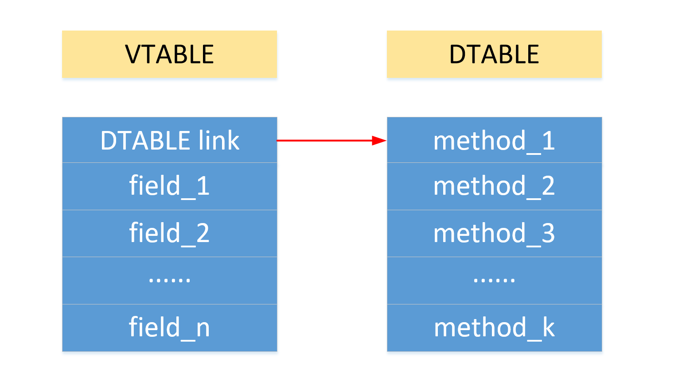

## 2. MiniJava2Piglet

+ [总目录](../README.md)

---

[TOC]

### 2.1 主要工作

+ 将符合 `minijava` 语法规范的代码转化为  `piglet` 代码
+ `piglet` 的 `BNF` 见[网站](http://compilers.cs.ucla.edu/cs132/project/piglet.html)
+ 这一部分的实现基于第一部分 `TypeChecker` 的代码

### 2.2 方法与设计

#### 2.2.1 类设计

##### 2.2.1.1 语法分析树中的类

+ 和 `TypeChecker` 中的类相同
+ 为了方便， 不再和 `TypeChecker` 一样使用私有字段的设计，使用 `public`
+ 给原来的类里面增加了一些字段和方法

###### MyIdentifier

+ `MyIdentifier` 用于获取一个 `Id(String)`

```java
public class MyIdentifier extends MyType {
    // 记录当前的实际类型,多态的时候会用到
    public String nowType = "";
    // 以上为增加部分

    // 变量列表(MyClass/MyMethod)
    // 由于规定所有的变量声明必须在所有的变量使用前HashMap就够了)
    // 这么设置会导致 MyVar 的空间变大(MyMethod/MyClass)
    private HashMap<String, MyVar> localVarList = new HashMap<>();
    // 父结点(MyVar/MyMethod)
    private MyIdentifier parent;
    ······
}
```

###### MyClass

+ `MyClass` 用于保存类信息

```java
public class MyClass extends MyIdentifier{
    // 需要为每个 class 维护一个 DTable/VTable
    // index->name; name->index
    // 注意这里的 VTable 包括父类的元素,但是按照一定顺序摆放(父类靠前)
    // DTable 子类同名函数覆盖
    public ArrayList<String> DTable = new ArrayList<>();
    public HashMap<String, Integer> offsetOfDTable = new HashMap<>();
    public ArrayList<String> VTable = new ArrayList<>();
    public HashMap<String, Integer> offsetOfVTable = new HashMap<>();
    // 以上为增加部分

    // 包括:函数列表(不允许重载), 继承类
    private HashMap<String, MyMethod> methodList = new HashMap<>();
    // 继承的父类名称
    private String extendsClassName;
    ······
}
```

###### MyMethod

+ `MyMethod` 用于保存函数信息

```java
// 方法类
public class MyMethod extends MyIdentifier{
    // 参数列表名称 ArrayList
    public ArrayList<String> parameterNameList = new ArrayList<>();
    // 以上为增加部分

    // 包括返回值类型, 变量列表, 参数列表
    private String returnType;
    // 参数列表
    private HashMap <String, MyVar> parameterList = new HashMap<>();
    // 参数类型列表
    private ArrayList<String> parameterTypeList = new ArrayList<>();
    ······
}
```

###### MyVarTypeList

+ 用于保存一组变量的类型
    + 在参数传递的过程中用到，用于参数匹配

```java
public class MyVarTypeList extends MyType{
    private ArrayList<String> varTypeList = new ArrayList<>();
    ······
}
```

###### MyClassList

+ 用于保存已经定义的所有类信息

```java
public class MyClassList extends MyType{
    // 没有顺序要求
    private HashMap<String, MyClass> classList = new HashMap<>();
    ······
}
```

###### MyExpression

+ 在 `TypeCheckerVisitor` 中判定类型匹配是使用到
+ 将 `MyType` 中的字段 `name` 使用为 `type`

```java
public class MyExpression extends MyType{
    // name 表示变量的类型
    ······
}
```

##### 2.2.1.2 其他类设计

###### Global

+ 增加了一些字段和方法(只给出增加的关键部分)

```java
public class Global {
    // 一些常量 : 19个(为了不出错)
    public static final String varBegin = "\nBEGIN\n";
    ······
    public static final String varTemp = " TEMP ";

    // 地址长度
    public static final int AddrLength = 4;
    // 最后面输出的 piglet
    public static String outputString = "";
    // TEMP 计数
    public static int tempCount = 20;
    // 获取一个 TEMP
    public static String getTemp() {
        return Global.varTemp + " " +(tempCount++) + " ";
    }
    // Label 计数
    public static int LabelCount = 0;
    // 获取一个 Label
    public static String getLabel() {
        return "L" + (Global.LabelCount++);
    }
    // 建立所有函数的符号表
    public static void buildMethodTable() {······}
    // 为所有的类建立 VTable 和 DTable
    public static void buildVDTable() {······}
    // 优化一下输出代码的结构
    public static void normOfOutputString() {······}
    ······
}
```

##### 2.2.1.3 visitor

###### GeneratePiglet

+ 生成 `piglet` 代码

```java
public class GeneratePiglet extends GJDepthFirst<MyType, MyType> {
    ······
}
```

### 2.3 实现思路

+ 函数名称
    + `piglet` 中没有类的概念
    + 为了保持类的方法，我们将类的方法名修改为 `ClassName_MethodName`
    + 然后将变量自身 （即`VTABLE`） 作为第一个参数传递给函数

+ 关于代码生成
    + `MainClass`，`MethodDeclaration` 只输出框架
        + 例如 `MethodDeclaration`  只输出 `BEGIN ··· RETURN ··· END`
    + 关于 `Expression` 的输出，只有如下 `3` 种情况输出
        + `ThisExpression`  -> `TEMP 0`
        + `AllocationExpression/ArrayAllocationExpression` -> `BEGIN ··· RETURN ··· END`
        + `PrimaryExpression` -> `已经有的 TEMP`
            + 正常不输出，但是不能都不输出，所以留给 `PrimaryExpression`
        + 另一方面也是因为 `Identifier` 的原因
                + 如果出现在 `PrimaryExpression` 则要输出
                + 如果出现在 `VarDeclaration` 则不输出
    + 关于 `IntegerLiteral/TrueLiteral` 等的输出，在 `visit` 对应的终结结点时输出
    + `Identifier` 特殊，声明时不输出，因此需要放在 `PrimaryExpression`  输出

+ 对于每一个变量维护一个 `VTABLE` 和 `DTABLE`

    + 结构如下

        

    + `VTABLE`

        + 第一项指向 `DTABLE` 的首地址
        + 剩余项指向变量
            + 简单变量存值
            + 复杂变量存首地址
            + 这与 `java` 中的 `=` 赋值规范相一致
        + 关于父类和当前类的同名字段
            + 我们保存的时候都保存，但是使用的时候只使用当前类的字段，因为不存在强制力类型转换或者其他方式能够调用到父类的字段

    + `DTABLE`

        + 刚开始的想法是不使用 `DTABLE`
            + 基于的想法是，不存在不初始化的类调用，因此只需要记录下变量法当前的实际类型，便可以找到具体的函数名称
            + 但是发现这样子的设计是有 **BUG** 的
                + 因为在函数参数中的变量的初始赋值是无法获取到的，因此不能够确定下来变量的当前实际类型，这里的多态无法解决
        + 后来还是使用 `VTABLE`
            + 将父类和子类的同名函数置于 `VTABLE` 的相同的偏移量的位置
            + 基于的想法是，不存在强制类型转换，所以子类调用不到父类的函数，所以直接覆盖就行了
        + 没有实现共享
            + 实现共享其实也不难，在 `Main` 里面为所有的类构建符号表的时候分配内存就行了

+ 数组的话

    + 首地址存数组的大小
    + 紧接着就存数组的元素

### 2.4 具体实现

#### 2.4.1 保存下来所有出现过的函数

+ 获取所有类，然后将类中的所有函数转换为 `ClassName_MethodName` 的形式加入 `HashSet` 即可

#### 2.4.2 为每一个类构建 VTABLE/DTABLE

+ `DTABLE`
    + 使用一个 `stack` 来保存继承的父类（向上递归直至没有父类），然后按照顺序加入父类的字段
    + 由于使用 `HashMap` 来保存字段和偏移量的对应关系，所以通过字段名获取到的偏移量实际上就是当前类的偏移量
+ `VTABLE`
    + 需要覆盖父类同名函数
        + 由于顺序是从父类（最祖先的父类）开始，所以每一次只需要检查是否有直接父类的同名函数即可
+ 代码较长，具体见  `Global.java`  文件

```java
// 为所有的类建立 VTable 和 DTable
public static void buildVDTable() {······}
```

#### 2.4.3 GeneratePiglet

##### 说在前面

+ 有几个部分的代码生成本质上就是一个转化，这里只给出如何转化，具体实现见代码

##### 获取参数

+ 与 `TypeCheckerVisitor` 一样，需要按照构建好的语法树进行参数传递
    + 例子如下

```java
/**
 * f0 -> "class"
 * f1 -> Identifier()
 * f2 -> "{"
 * f3 -> ( VarDeclaration() )*
 * f4 -> ( MethodDeclaration() )*
 * f5 -> "}"
 */
@Override
public MyType visit(ClassDeclaration n, MyType arg) {
    MyType _ret = null;
    n.f0.accept(this, arg);
    // 获取类名
    MyIdentifier id = (MyIdentifier)n.f1.accept(this, arg);
    MyClass commonClass = ((MyClassList)arg).getClassByName(id.getName());
    n.f2.accept(this, commonClass);
    n.f3.accept(this, commonClass);
    n.f4.accept(this, commonClass);
    n.f5.accept(this, commonClass);
    return _ret;
}
```

##### name2Temp

```java
HashMap<String,String> name2Temp = new HashMap<>();
```

+ 简单的实现，对于每一个函数维护一个变量名到 `TEMP` 的映射关系
    + 临时变量、参数列表中的变量需要加入 `name2Temp`
    + 成员变量不需要，因为已经存在 `TEMP 0` 中了
+  `MethodDeclaration`
    + 清空 `name2Temp`
    + 加入 `this -> TEMP 0`
    + 逐个加入参数列表中的参数
        + 如果超过 `19` 个(因为 `this` 占掉一个)，只保存前 `19` 个
        + 后面的存在 `TEMP 19` 对应的数组中，对应下标可以通过在参数列表中的位置计算得到
+ `VarDeclaration`
    + 若是函数内部的局部变量(`arg instanceof MyMethod`)，则加入

##### MainClass

+ `main` 函数不存在 `visit` ，需要手动构造 `main` 函数的参数列表

##### Expression

+ 由于初始的不使用 `DTABLE` 的想法
    + 对于每一个 `exp` 都需要记录当前类型，因此需要返回一个 `MyType` 记录当前类型

##### AssignmentStatement

```java
/**
 * f0 -> Identifier()
 * f1 -> "="
 * f2 -> Expression()
 * f3 -> ";"
 */
@Override
public MyType visit(AssignmentStatement n, MyType arg) {······}
```

+ `f0` 是成员变量
    + `HSTORE TEMP 0 Exp`
+ `f0` 是局部变量/参数列表中编号小于 `19` 的变量
    + `MOVE TEMP * Exp`
+ `f0` 是参数列表中编号大于 `19` 的变量
    + `HSTORE TEMP 19 Exp`
+ 同时需要修改 `f0` 变量的当前类型为 `f1` 的当前类型

##### ArrayAssignmentStatement

+ 与 `AssignmentStatement` 的实现类似，不过不需要修改类型，只可能是 `int`，而且保存的时候需要保存到内存（数组存的是数组的首地址）

+ 检查数组越界
    + 加载数组长度，作比较，若越界，`ERROR` 掉

    + 仿照 `Bubblesort.pg` 实现

        ```haskell
         TEMP 22 : length
         TEMP 23 : index

            HLOAD TEMP 21 TEMP 22 0
            CJUMP L0 LT TEMP 21 TEMP 23
            ERROR
         L0 NOOP
        ```

##### IfStatement

+ 直接转换即可

    ```haskell
    if exp:
        s1;
    else:
        s2;

       CJUMP exp L1
       s1
       JUMP L2
    L1 NOOP
       s2
    L2 NOOP
    ```

##### WhileStatement

+ 直接转换即可

    ```haskell
    while exp:
        statement

    L1 NOOP
       CJUMP exp L2
       statement
       JUMP L1
    L2 NOOp
    ```

##### AndExpression

+ 注意短路操作

+ 直接转化即可

    ```haskell
    Exp1 && Exp2

    BEGIN
       MOVE TEMP 21 0
       CJUMP Exp1 L1
       MOVE TEMP 21 Exp2
    L1 NOOP
    RETURN
       TEMP 21
    END
    ```

##### PlusExpression/MinusExpression/TimesExpression

+ 直接转化即可

+ 以 `MinusExpression` 为例

    ```haskell
    exp1 - exp2
    /*******************/
    MINUS exp1 exp2
    ```

##### ArrayLookup

+ 需要检查数组是否越界

    ```haskell
    exp1 [ exp2 ]

    BEGIN
        MOVE TEMP 21 exp1
        MOVE TEMP 22 exp2        // 索引
        HLOAD TEMP 23 TEMP 21 0  // 长度
        CJUMP MINUS 1 LT TEMP 22 TEMP 23 L1
        ERROR
    L1  NOOP
        HLOAD TEMP 24 PLUS TEMP 21 TIMES 4 PLUS 1 TEMP 22 0
    RETURN
        TEMP 24
    END
    ```

##### ArrayLength

+  `ArrayLength` 就是 `ArrayLookup` 的第一小部分

##### MessageSend

```haskell
exp1.exp2( (exp)* )

CALL Func "(" VTable (exp)* ")"
```

+ 这里的 `exp2` 需要区分 `id`，`new`，`this`

+ 通过返回值区分

+ 这里比较复杂，需要解决的问题

    + 继承了父类的函数
        + 逐个向上查找是否存在同名函数
    + 多态
        + 由于子类的同名函数和父类的同名函数具有相同的 `Offset` ，只需要获取到 `Offset` 就行了
        + `Offset` 可以直接从当前类的函数表里获取
    + 参数超过 `19` 个
        + 配合 `ExpressionList`，`ExpressionRest`实现
        + 记录下当前调用的函数
        + 记录下当前调用参数的个数
        + 这个有个需要注意的点，可能存在调用的嵌套，因此每次进入`ExpressionList`，`ExpressionRest`的时候需要记录下当前调用的函数 `paraMethod` 以及已经填充的参数个数 `paraCount`

    ```haskell
    BEGIN
        MOVE paraBaseAddr HALLOCATE TIMES LeftParas 4
        HSTORE paraBaseAddr 0 Exp1
        ......
        HSTORE paraBaseAddr Offset Expx
        ......
    RETURN
        paraBaseAddr
    END
    ```

##### PrimaryExpression

+ `Expression` 输出的一种情况
+ 如果返回值是 `MyIdentifier` 需要修改为 `MyType`
    + 避免重复输出

##### ThisExpression

+ `Expression` 输出的一种情况
+ `TEMP 0`

##### FalseLiteral/TrueLiteral/IntegerLiteral/NotExpression

+ 直接输出
+ `NotExpression` 只输出 `MINUS 1` 部分

##### Identifier

+ 不输出
+ 需要区分声明和引用

##### ArrayAllocationExpression

+ `Expression` 输出的一种情况
+ 分配数组，同时清 `0`

```haskell
new int [Exp]

BEGIN
    MOVE TEMP 21 Exp                                 // 长度
    MOVE TEMP 22 HALLOCATE TIMES 4 PLUS 1 TEMP 21    // 基址
    HSTORE TEMP 22 0 TEMP 21
    // 初始化为 0, 仿 Bubblesort
L1  CJUMP LT 0 TEMP 21 L2
    HSTORE PLUS TEMP 22 TIMES 4 TEMP 21 0 0
    MOVE TEMP 21 MINUS TEMP 21 1
    JUMP L1
L2  NOOP
RETURN
    TEMP 22
END
```

##### AllocationExpression

+ 直接复制类中的 `VTABLE/DTABLE`

#### 2.4.4 优化一下代码输出的结构

+ 调整缩进，调调空格

```java
public class Global{
    ······
    // 优化一下输出代码的结构
    public static void normOfOutputString() {
        Global.outputString = Global.outputString.replaceAll("  ", " ");
        String[] seg = Global.outputString.split("\n");
        String _ret = "";
        int tab = 0;
        String blank = "    ";
        for(String x : seg) {
            String temp = x.trim();
            if(x.equals("")) continue;
            if(temp.startsWith("BEGIN")||temp.startsWith("MAIN")) {
                for(int i = 0;i < tab;++i)
                    temp = blank + temp;
                ++tab;
            }
            else if(temp.startsWith("RETURN") || temp.startsWith("L")) {
                for(int i = 0;i < tab-1;++i)
                    temp = blank + temp;
            }
            else if(temp.startsWith("END")) {
                --tab;
                for(int i = 0;i < tab;++i)
                    temp = blank + temp;
            }
            else {
                for(int i = 0;i < tab;++i)
                    temp = blank + temp;
            }
            _ret += temp + "\n";
        }
        Global.outputString = _ret;
    }
}
```

