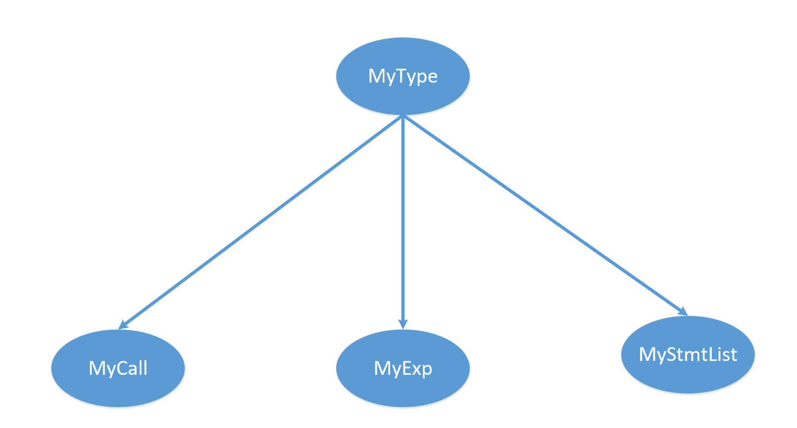

## 3. Piglet2Spiglet

+ [总目录](../README.md)

---

[TOC]

### 3.1 主要工作

+ 将符合 `piglet` 语法规范的代码转化为 `spiglet` 代码

+ `spiglet` 的 `BNF` 见 [网站](http://compilers.cs.ucla.edu/cs132/project/spiglet.html)
+ 主要工作就是消除 `piglet` 代码中的复合语句

### 3.2 方法与设计

#### 3.2.1 生成语法树类文件和词法语法分析器

+ 使用 `JAVACC` 和 `JTB`

```shell
java -jar jtb132.jar piglet.jj
java javacc jtb.out.jj
```

#### 3.2.2 类设计

##### 3.2.2.1 语法分析树中的类



###### MyType

+ 所有类的基类
+ 重载了 `toString`
    + 方便输出

```java
public class MyType {
    // TEMP
    public String name;

    // whether TEMP(原来)
    public boolean isTemp = false;

    // whether SimpleExp(原来)
    public boolean isSimple = false;

    // isTemp => isSimple

    ······

    @Override
    public String toString() {
        return this.name;
    }
}
```

###### MyCAll/MyExp/MyStmtList

+ 单纯是为了区分返回值
    + `instanceof`

```java
public class MyExp extends MyType{
    public MyExp() {}
}

public class MyStmtList extends MyType{
    public MyStmtList() {}
}

public class MyCall extends MyType {
    public MyCall() {}
}
```

##### 3.2.2.2 其他类设计

###### Global

+ 保存一些需要全局调配的全局变量

```java
package global;

import java.util.ArrayList;

public class Global {
    // 一些常量
    public static final String varBegin = "\nBEGIN\n";
    ······
    public static final String varTemp = " TEMP ";

    public static ArrayList<String> paras = new ArrayList<>();

    // 输出
    public static String outputString = "";

    // 当前已使用的最大 TEMP
    public static int tempNum = 0;

    // 获取一个新的 TEMP
    public static String getTemp() {
        return Global.varTemp + (++Global.tempNum) + " ";
    }

    // 优化一下输出代码的结构
    public static void normOfOutputString() {······}
}
```


##### 3.2.2.3 visitor

###### GetMaxTempNum

+ 获取当前使用的 `TEMP` 的最大编号

```java
// no arg, no return value
public class GetMaxTempNum extends DepthFirstVisitor {
    /**
     * f0 -> "TEMP"
     * f1 -> IntegerLiteral()
     */
    @Override
    public void visit(Temp n) {
        n.f0.accept(this);
        n.f1.accept(this);
        int tempNum = Integer.parseInt(n.f1.f0.tokenImage);
        if(tempNum > Global.tempNum)
            Global.tempNum = tempNum;
    }
}
```

##### GenerateSpiglet

+ 生成代码

```java
public class GenerateSpiglet extends GJDepthFirst<MyType, MyType> {······}
```


### 3.3 实现思路

+ 先获取当时使用的最大的 `TEMP` 编号，然后每一次获取就重新取一个
    + 当然可以优化，每次在进入函数之前，将当前 `TEMP`  设为获取到的最大值，而不是累加

+ 直接将复合语句拆解即可，其他语句正常输出

### 3.4 具体实现

#### GetMaxTempNum

+ 如上就是全部代码

#### GenerateSpiglet

##### 想法

+ 子结点将复合语句拆解然后返回给父结点自身是否为 `TEMP`
+ `IntegerLiteral/Label/TEMP` 不输出(父类输出)
+ `Exp` 不能返回 `null` ,不输出
    + 返回之后已经转化为一个 `TEMP`
+ 正常情况下 `Goal` 等就输出框架，然后其余输出由终结结点输出
+ 父子结点的传递参数为 `null` ，除非有其他用处
+ 关于 `Label` 的输出
    + 若父类为 `StmtList` 直接输出
    + 否则由父类输出
+ 遇见返回的 `exp` 如果不是 `TEMP` 那么就多加一个 `MOVE` 操作

##### Goal

+ 输出框架
+ 以  `Goal` 为例

```java
/**
 * f0 -> "MAIN"
 * f1 -> StmtList()
 * f2 -> "END"
 * f3 -> ( Procedure() )*
 * f4 -> <EOF>
 */
@Override
public MyType visit(Goal n, MyType arg) {
    MyType _ret = null;
    n.f0.accept(this, null);// MAIN
    Global.outputString += Global.varMain;
    n.f1.accept(this, null);
    Global.outputString += Global.varEnd;
    n.f2.accept(this, null);// END
    n.f3.accept(this, null);
    n.f4.accept(this, null);
    return _ret;
}
```

##### StmtList

+ 需要输出 `Label` （如果有的话）
+ 因此参数下传参数需要有（用于区分）

```java
/**
 * f0 -> ( ( Label() )? Stmt() )*
 */
@Override
public MyType visit(StmtList n, MyType arg) {
    MyType _ret = null;
    // Label
    n.f0.accept(this ,new MyStmtList());
    // n.f0.accept(this ,null);
    return _ret;
}
```

##### NoOpStmt/ErrorStmt/JumpStmt

##### PrintStmt/HLoadStmt/HStoreStmt

##### CJumpStmt/BinOp/HAllocate/Operator

+ 直接转换输出
    + 需要检查返回的 `exp` 是否为 `TEMP`
+ 以 `NoOpStmt` 为例

```java
/**
 * f0 -> "NOOP"
 */
@Override
public MyType visit(NoOpStmt n, MyType arg) {
    MyType _ret = null;
    n.f0.accept(this, null);// NOOP
    Global.outputString += Global.varNoop;
    return _ret;
}
```

##### StmtExp

+ 有些地方需要检查返回值是否为 `simpleExp`

##### TEMP/IntegerLiteral

+ 不输出
+ 需要被父类调整位置

##### Label

+ 若父类为 `MyStmtList` 则输出，其余不输出

##### Call

+ 需要处理 `CALL` 嵌套的问题
    +  `=>`  **后序** 遍历输出即可
    + 需要记录所有的参数列表 `Glboal.paras`

```haskell
CALL Exp1 A (
    CALL A(
        TEMP 21 TEMP 22
    )

    CALL A (
        TEMP 23, CALL A (
            TEMP 24 TEMP 25
        )
    )
)

MOVE TEMP 26 CALL ( TEMP 21 TEMP 22 )
MOVE TEMP 27 CALL ( TEMP 24 TEMP 25 )
MOVE TEMP 28 CALL ( TEMP 23 TEMP 27 )
MOVE TEMP 29 CALL ( TEMP 26 TEMP 28 )
```

+ 需要记录当前调用函数
+ 传参时引入`MyCall`

```java
n.f3.accept(this, new MyCall());// (Exp)*
```

##### NodeListOptional

+ 用于传递 `Call`  和 `StmtList` 的关键步骤
+ 由于存在 `Call` 的嵌套调用，每次进入下一个参数前，需要保存当前的参数调用列表

```java
/* NodeListOptional */
@Override
public MyType visit(NodeListOptional n, MyType arg) {
    // Goal/StmtList/Call
    MyType upDown = null;

    // 如果是 MyStmtList 传下来的就直接下传(为了 Label )
    if(arg != null && arg instanceof MyStmtList)
        upDown = arg;
    if ( n.present() ) {
        MyType _ret = null;
        if(arg != null && arg instanceof MyCall) {
            // 保存当前调用的记录
            ArrayList<String> tempParas = Global.paras;
            for(Enumeration<Node> e = n.elements(); e.hasMoreElements();){
                MyType exp = e.nextElement().accept(this, upDown);
                if(!exp.isTemp) {
                    String t1 = Global.getTemp();
                    Global.outputString += Global.varMove + t1 + exp;
                    exp = new MyType(t1, true);
                }
                tempParas.add(exp.toString());
            }
            // 恢复记录
            Global.paras = tempParas;
        }
        // origin
        else {
            // int _count = 0;
            for(Enumeration<Node> e = n.elements(); e.hasMoreElements();){
                e.nextElement().accept(this, upDown);
                // _count++;
            }
            return _ret;
        }
        return _ret;
    }
    else
        return null;
}
```


#### Global.normOfOutputString()

+ 优化代码结构与 `minijava2piglet` 相同

