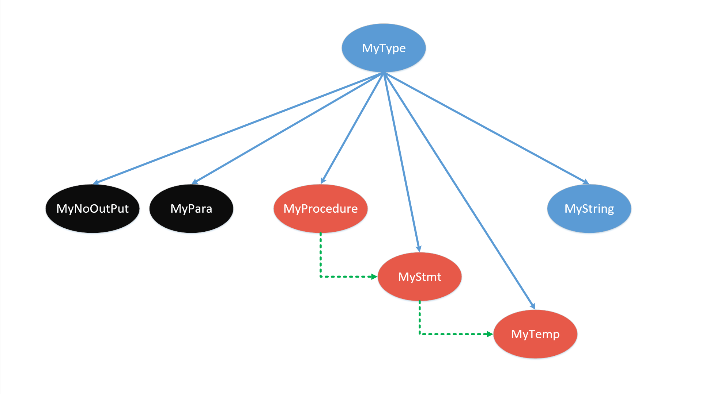

## 4. Spiglet2Kanga

+ [总目录](../README.md)

---

[TOC]

### 4.1 主要工作

+ 将符合 `spiglet` 规范的代码转化为 `kanga` 代码
+ `kanga` 的 `BNF` 见 [网站](http://compilers.cs.ucla.edu/cs132/project/kanga.html)
+ `kanga` 的特点
    + 寄存器有限
    + `Label` 是全局的
+ `kanga` 的寄存器是有限的，因此代码转换的主要工作如下
    + **活性分析**
    + **寄存器分配**
    + **代码生成**

### 4.2 方法与设计

#### 4.2.1 生成语法树类文件和词法语法分析器

+ 使用 `JAVACC` 和 `JTB`

```shell
java -jar jtb132.jar spiglet.jj
java javacc jtb.out.jj
```

#### 4.2.2 类设计

##### 4.2.2.1 语法分析树中的类

+ `symbol.*`
+ 实线表示 **继承** 关系，虚词表示 **包含** 关系（逻辑上）



+ 大体上分作 `3` 种
    + `MyNoOutput`，`MyPara`
        + 没有修改 `MyType` 使用 `instanceof` 作为一个分类
    + `MyProcedure`，`MyStmt`，`MyTemp`
        +  关键的类
    + `MyString`
        + 辅助类


###### MyType

+ 所有类的基类

```java
public class MyType {
    MyType(){}
}
```


###### MyTemp

+ 一个变量的活性区间

```java
public class MyTemp extends MyType {
    /** TEMP 名称 */
    public final String name;
    /** 名称对应的数字 */
    public final int nameDigit;
    /** 活性区间起点 */
    public int start;
    /** 活性区间终点 */
    public int end;
    /** 构造函数 */
    public MyTemp(String name){
        this.name = name;
        this.nameDigit = Integer.parseInt(name);
    }
}
```


###### MyStmt

+ 对应于 `spiglet` 中的一个 `Stmt`
+ 同样为了处理方便，这里只记录 `Temp` 的名称

```java
public class MyStmt extends MyType {
    /**
     * 约束(可以通过如下方式一致解决)
     * Constraints(v) = join(v) - id + vars
     */
    public TreeSet<String> Constraints;
    /** id(Set处理起来比较方便) */
    public HashSet<String> id;
    /** 变量列表(right)  */
    public HashSet<String> vars;
    /** 后继列表 */
    public HashSet<Integer> next;
}
```


###### MyProcedure

+ 对应于 `spiglet` 中的一个函数过程
+ 考虑到函数定义问题，为了处理上的方便，调用的函数序列只记录函数名称

```java
public class MyProcedure extends MyType {
    /** 函数名称 */
    public String name;
    /** 调用其他过程的最大参数个数 */
    public int callParas;
    /** 参数个数 */
    public int paras;
    /** 栈单元个数的调用参数 */
    public int stackSize;
    /** 构造函数, 名称+参数个数*/
    public MyProcedure(String name, int nowParas) {
        ······
    }

    // 关于 Label
    /** 维护一个从旧的Label到新的Label的映射(因为Kanga的Label是全局的) */
    public HashMap<String, String> labelTrans;

    // 关于活性区间
    /** TEMP 到活性区间的映射 */
    public HashMap<String, MyTemp> name2temp;
    /** MyTemp 数组 */
    public ArrayList<MyTemp> temps;
    /** 寄存器分配 */
    public HashMap<String, String> temp2reg;
    /** 溢出的变量对应溢出的单位(第一个溢出变量的偏移设为1) */
    public HashMap<String, Integer> temp2spilled;
    /** 溢出变量的偏移 */
    public int offsetForSpilled;
}
```


###### MyString

+ 在生成 `kanga` 代码时用于回传

```java
public class MyString extends MyType {
    /** 返回的语句 */
    public String stmt;
    public MyString(String stmt) {
        this.stmt = stmt;
    }

    /** 返回该语句*/
    @Override
    public String toString() {
        return this.stmt;
    }
}
```


##### 4.2.2.2 其他类设计

###### global.Global

+ 保存一些全局变量以及一些函数

```java
public class Global {
    // 一些常量
    public static final String varMain = " MAIN ";
    ······

    /** 获取一个新的 Label */
    public static String getLabel() {······}

    /** 保存所有 Procedure 的数组 */
    public static ArrayList<MyProcedure> proc = new ArrayList<>();
    /** 所有的函数名称的 Set */
    public static HashSet<String> procSet = new HashSet<>();

    /** 输出的 Kanga 代码 */
    public static String outputString = "";

    /** 将输出规范化 */
    public static void normOfOutputString() {······}

    /** 在构造好了用于规则推导的初始约束变量之后要做的事 */
    public static void deal() {
        Global.livenessAnalysis();
        Global.constructLivenessInterval();
        Global.regDistribution();
        Global.calcStackSize();
        Global.calcProcLabel();
        Global.calcOffsetOfSpilled();
    }

    /** 重新计算溢出寄存器的 offset */
    public static void calcOffsetOfSpilled() {······}

    /** 生成一个关于所有的函数名称的 HashSet */
    public static void calcProcLabel() {······}

    /** 计算每一个函数的栈大小 */
    public static void calcStackSize() {······}

    /** 为每个变量构建活性区间,没有考虑变量复用 */
    public static void constructLivenessInterval() {······}

    /** 活性分析,规则推导 */
    public static void livenessAnalysis() {······}

    /** 寄存器分配(已经排序好了) */
    public static void regDistribution() {······}
}
```

###### helper.MyPair

+ 对于一个 `Stmt` 中的变量，若溢出，则需要记录，用于恢复

```java
public class MyPair {
    public String reg;
    public int offset;
    public MyPair(String reg, int offset){
        this.reg = reg;
        this.offset = offset;
    }
}
```


###### helper.MyIsSpilled

+ 用于翻译 `spiglet` 中的 `CallStmt` 时判断变量是否溢出用

```java
/** 用于 CALL 语句中的参数 */
public class MyIsSpilled {
    public String name;
    /** 溢出的参数,包括前4个参数 */
    public boolean isSpilled;
    public int offset;
    public MyIsSpilled(String name, boolean isSpilled, int offset){
        this.name = name;
        this.isSpilled = isSpilled;
        this.offset = offset;
    }
}
```


##### 4.2.2.3 visitor

###### GenerateLiveMap

+ 构造好每一个用于 **规则推导** 的结构
+ 构造好 `MyProcedure`，`MyStmt`，`MyTemp` 之间的关系
+ 更新 `Label`

```java
public class GenerateLiveMap
    extends DepthFirstVisitor{······}
```


###### GenerateKanga

+ 生成 `Kanga` 代码

```java
public class GenerateKanga
    extends GJDepthFirst<MyType, MyType>{······}
```

### 4.3 实现思路

+ 两次遍历语法树，第一次用于构造结构，第二次生成 `kanga` 代码

#### 4.3.1 活性分析

+ 方法 : **规则推导**
+ 将每一个函数过程看作一个活性分析的基本单位
+ 对于每一个活性分析的单元，`Stmt` 构成自然顺序
+ 增加一个退出节点 `exit`
+ 统一使用如下实现方式
    +  `Constraints(v) = join(v) - id + vars`
        + 具体的情况只是某几项为空集
    + `join(v) = U Constraints(w:w是v的后继)`
+ 后继节点
    + `NoOpStmt`，`HStoreStmt`，`HLoadStmt`，`MoveStmt`，`PrintStmt`
        + 后继节点为下一个语句
    + `ErrorStmt`
        + 后继节点为 `exit` 结点
    + `CJumpStmt`，`JumpStmt`
        + 后继节点为下一个语句和跳转目标
        + 跳转目标根据 `Label` 的位置事先处理好
+ 变量归属
    + 除了 `HloadStmt`，`MoveStmt` 的目标设为 `id` 之外，其他都归到 `vars`
    + 将参数的声明归属到第一句的 `id`
+ 活性分析
    + 反复迭代至不动点

#### 4.3.2 寄存器分配

+ 简易版本实现，我们不考虑变量的复用
    + 将变量的第一次出现设为活性区间的开始
    + 将变量的最后一次出现设为活性区间的结束
+ 寄存器的安排
    + `a` 系寄存器不用于分配
    + `s/t` 系寄存器全用于分配（除了 `t9`）
        + 全部都是 `callee-saved`，使用之前需要保存
    + `v0,v1,t9` 用于作为临时寄存器在生成 `kanga` 代码时使用
+ **线性扫描** 分配寄存器
    + 前 `4` 个参数不重新分配寄存器
    + 在实现上我们也使用了一些比较 `naive` 的想法
        + 首先对变量进行排序
            + 活性区间的开始作为第一关键字
            + 活性区间的结束作为第二关键字
        + 排好序之后逐个分配寄存器
        + 另外维护一个变量数组，按照活性区间的结束排序
            + 用于检查是否该回收已经分配寄存器
        + 对于变量的溢出方面
            + 在分配时没有空闲寄存器的情况下，我们直接溢出这个变量
                + 而不是算法中说的溢出最晚的
                + 这是为了处理方便，变量绑定寄存器无需修改
        + 对于溢出的变量我们不会将其绑定回某一个的寄存器
            + 即分配的时候寄存器不够，将其溢出了
            + 在之后我们并不是试图在寄存器空余的时候将其重新绑定

#### 4.3.3 kanga代码生成

+ 一些尝试
    + 大量使用语法树中建构好的结构，而不是使用 `accept`
        + 加快编译速度
    + 将一些无用的 `accept` 直接不进去

+ `v0,v1,t9` 作为临时寄存器，拆分 `spiglet` 代码时使用
    + 最多 `3` 个
    + `callStmt` 中多次使用，但是并不会重叠
        + 使用一个固定的寄存器
+ 进入函数之前保存所有的  `s/t` 寄存器（除了`t9`）
+ 在进行函数调用的时候保存好 `a` 系寄存器（用几个存几个）

#### 4.3.4 其他实现

+ `kanga` 的 `Label` 是全局的，用一个全局的 `Map` 维护新旧 `Label` 的映射
+ 每一个函数 (Procedure) 栈空间的大小
    + 所有 `callee-saved` 寄存器的个数
    + 参数个数
        + 注意这里需要包含前 `4` 个
        + 因为我们没有为前 `4` 个参数重新分类寄存器
        + 在进行函数调用的时候，我们需要保存现在的 `a` 系寄存器
    + 溢出的变量个数

### 4.4 具体实现

+ 具体实现比较长，这里只记录一些关键步骤，其余见代码

#### GenerateLiveMap

+ 主要完成 `Procedure-Stmt-Temp` 的构建

##### Goal/Procedure

+ 构建 `Procedure`
+ 以 `MAIN` 为例

```java
public void visit(Goal n) {
    // 构造 Procedure 并加入 Global, 清空 label2Index
    this.nowProc = new MyProcedure("MAIN", 0);
    Global.proc.add(this.nowProc);
    this.label2Index.clear();
    // 因为第一个是 0
    this.nowStmtIndex = -1;
    n.f0.accept(this);
    n.f1.accept(this);
    n.f2.accept(this);
    // 添加一个退出结点
    this.nowProc.addStmt(new MyStmt());
    n.f3.accept(this);
    n.f4.accept(this);
}
```


##### StmtList

+ 构建 Label 与行号的映射关系

```java
public void visit(StmtList n) {
    // 处理 Label 的映射 + 处理 Label 的 Stmt 序号
    int index = -1;
    // 直接获取 StmtList 的 size
    // 需要加上一个 RETURN(而且RETURN在exit之前)
    // 注意 MAIN 是没有 RETURN 的
    if(!(this.nowProc.name.equals("MAIN")))
        this.nowProcTotalStmt = n.f0.nodes.size() + 1;
    for(Node t1 : n.f0.nodes) {
        ++ index;
        if(!(t1 instanceof NodeSequence)) continue;
        Node t2 = ((NodeSequence)t1).nodes.get(0);
        if(!(t2 instanceof NodeOptional)) continue;
        Node t3 = ((NodeOptional)t2).node;
        if(!(t3 instanceof Label)) continue;
        String oldLabel = ((Label)t3).f0.tokenImage;
        checkLabel(oldLabel);
        this.label2Index.put(oldLabel, index);
    }
    n.f0.accept(this);
}
```


##### Stmt

+ 构造 `Procedure-Stmt`

```java
public void visit(Stmt n) {
    // 构造 Stmt 并加入 Procedure
    // 构造 Stmt(id/vars)
    this.nowStmt = new MyStmt();
    this.nowProc.addStmt(nowStmt);
    // 调整当前 Stmt 的 index
    ++this.nowStmtIndex;
    n.f0.accept(this);
}
```


##### CJumpStmt

+ 具体构造当前语句
+ 以 `CJumpStmt` 为例

```java
public void visit(CJumpStmt n) {
    // 后继有两个:Label所在的行数+下一行
    String tlabel = n.f2.f0.tokenImage;
    this.nowStmt.addNext(this.nowStmtIndex + 1);
    this.nowStmt.addNext(this.label2Index.get(tlabel));
    n.f0.accept(this);
    n.f1.accept(this);
    n.f2.accept(this);
}
```

#### Global.deal()

##### Glboal.livenessAnalysis

+ 活性分析，一个反复迭代

```java
/** 活性分析,规则推导 */
public static void livenessAnalysis() {
    // 需要对多余的参数进行寄存器分配
    // 对每一个 Procedure 进行规则推导
    for(MyProcedure p : Global.proc) {
        // 多余的参数进行寄存器分配
        if(p.paras > 4) {
            MyStmt firstStmt = p.stmt.get(0);
            for(int i = 4; i < p.paras; ++i)
                firstStmt.id.add("" + i);
        }
        int size = p.stmt.size();
        // 感觉 clear 比 new 快
        TreeSet<String> join = new TreeSet<String>();
        while(true) {
            boolean stable = true;
            for(int i = size - 1; i >= 0; --i) {
                MyStmt nowStmt = p.stmt.get(i);
                join.clear();
                // join(v) = U Constraints(w:w是v的后继)
                // 逐个加入 Constraint
                for(int x : nowStmt.next) {
                    if(x >= p.stmt.size()) {
                        System.err.println("INDEX OUT!");
                    }
                    join.addAll(p.stmt.get(x).Constraints);
                }
                // newConstraint = join - id + vars
                join.removeAll(nowStmt.id);
                join.addAll(nowStmt.vars);
                if(!join.equals(nowStmt.Constraints)) {
                    stable = false;
                    nowStmt.Constraints.clear();
                    nowStmt.Constraints.addAll(join);
                }
            }
            if(stable) break;
        }
    }
}
```


##### Global.regDistribution

+ 寄存器分配

```java
public static void regDistribution() {
    // 所有的待分配的寄存器
    HashSet<String> allFreeReg = new HashSet<>();
    for(String reg : Global.tReg) allFreeReg.add(reg);
    for(String reg : Global.sReg) allFreeReg.add(reg);
    // 接下来用于分配的寄存器(之所以写外面是为了避免 new)
    HashSet<String> freeReg = new HashSet<>();
    // p.temps 的一个拷贝,用于判断寄存器的回收,(之所以写外面是为了避免 new)
    ArrayList<MyTemp> cloneTemps = new ArrayList<>();
    for(MyProcedure p : Global.proc) {
        // 准备工作,注意 clear
        freeReg.clear();
        freeReg.addAll(allFreeReg);
        cloneTemps.clear();
        cloneTemps.addAll(p.temps);
        // 按照结束时间排序
        cloneTemps.sort((a,b)->{return a.end - b.end;});
        int recycle = 0;
        int size = cloneTemps.size();
        // 开始分配寄存器
        for(MyTemp nowTemp : p.temps) {
            int nowStmtIndex = nowTemp.start;
            // 每前进一步需要检查此时是否有寄存器可以变为重新分配
            // step 0 : 回收寄存器
            while(recycle < size) {
                // 回收
                if(cloneTemps.get(recycle).end < nowStmtIndex) {
                    String tempName = cloneTemps.get(recycle).name;
                    String recycleReg = p.temp2reg.get(tempName);
                    // 如果本身就溢出了,不回收
                    if(recycleReg != null)
                        freeReg.add(recycleReg);
                    ++recycle;
                }
                else break;
            }
            // step 1 : 已经分配过了
            if(p.temp2reg.containsKey(nowTemp.name)) continue;
            // step 2 : 试图找到能够分配的寄存器分配
            // 满了就溢出
            // 这里为了方便实现,当寄存器不够的时候直接溢出,而不是溢出最晚的
            if(freeReg.isEmpty()) {
                p.temp2spilled.put(nowTemp.name, ++p.offsetForSpilled);
            }
            // 未满就分配寄存器
            else {
                // 这里也没有随机的意味,只需要取出一个即可
                String reg = freeReg.iterator().next();
                freeReg.remove(reg);
                p.temp2reg.put(nowTemp.name, reg);
            }
        }
    }
}
```


#### GenerateKanga

##### Goal/Procedure

+ 生成具体的函数体
+ 以 `Procedure` 为例

```java
public MyType visit(Procedure n, MyType arg) {
    this.refreshProc();
    // MAIN
    Global.outputString += this.nowProc.name
        + " [" + this.nowProc.paras + "]"
        + "[" + this.nowProc.stackSize + "]"
        + "[" + this.nowProc.callParas + "]\n";
    n.f4.accept(this, arg);
    Global.outputString += Global.varEnd;
    return null;
}
```


##### Stmt

+ 构建 `Stmt` 的输出
+ 因为考虑到一些语句可能需要从栈上读取
    + 需要记录这些（结束需要恢复）
    + 将最后的实际操作的语句由 `Stmt` 输出

```java
public MyType visit(Stmt n, MyType arg) {
    // 清空临时寄存器
    this.freeAllTemporaryReg();
    this.restoreSpilled.clear();
    MyType stmt = n.f0.accept(this, new MyNoOutput());
    if(stmt == null) {
        // 当前语句没用
        // 本来应该有寄存器分配,但是却没有,不溢出,则修改为 NOOP
        // 这是为了处理有 Label 的情况
        // Label -> Label NOOP
        Global.outputString += Global.varNoop;
    }else {
        Global.outputString += stmt.toString() + "\n";
    }
    // 绑定到栈上的变量恢复(溢出)
    for(MyPair pair : this.restoreSpilled) {
        Global.outputString += Global.varAStore + Global.varSpilled
            + pair.offset + pair.reg + "\n";
    }
    return null;
}
```


##### StmtExp

+ 只会出现在函数体内
+ 需要做的事
    + 保存所有的 `s/t` （除 `t9` ）寄存器
    + 加载所有的参数
    + 进入子结点
    + 恢复所有的 `s/t` （除 `t9` ）寄存器

```java
public MyType visit(StmtExp n, MyType arg) {
    // step 1.保存所有的寄存器 callee-saved
    // ASTORE SPILLEDARG 0 s0
    int offset = -1;
    // 预留传参的空间
    offset += (this.nowProc.paras > 4 ? this.nowProc.paras - 4 : 0);
    offset += this.nowProc.paras > 4 ? 4 : this.nowProc.paras;
    for(String reg : Global.sReg) {
        Global.outputString += Global.varAStore + Global.varSpilled
            + (++offset) + reg + "\n";
    }
    for(String reg : Global.tReg) {
        Global.outputString += Global.varAStore + Global.varSpilled
            + (++offset) + reg + "\n";
    }
    // step 2.加载所有的参数
    int paras = this.nowProc.paras;
    for(int i = 4; i < paras; ++i) {
        String oriTemp = i + "";
        // 已分配寄存器就加载到指定寄存器
        String reg = this.nowProc.temp2reg.get(oriTemp);
        // 若没有分配寄存器,可能是因为没有用到,也可能是因为寄存器溢出
        // 以上两种情况都不需要处理
        if(reg != null) {
            // ALOAD s0 SPILLEDARG 0
            Global.outputString += Global.varALoad + reg
                + Global.varSpilled + (i - 4) + "\n";
        }
    }
    n.f1.accept(this, arg);
    MyString ret = (MyString)(n.f3.accept(this, arg));
    if(ret == null) {
        System.err.println("ERROR:RETURN NULL!");
    }
    Global.outputString += Global.varMove + Global.v0 + ret + "\n";
    // step 3.恢复所有的寄存器
    // ALOAD s3 SPILLEDARG 3
    offset = -1;
    offset += (this.nowProc.paras > 4 ? this.nowProc.paras - 4 : 0);
    offset += this.nowProc.paras > 4 ? 4 : this.nowProc.paras;
    for(String reg : Global.sReg) {
        Global.outputString += Global.varALoad + reg
            + Global.varSpilled + (++offset) + "\n";
    }
    for(String reg : Global.tReg) {
        Global.outputString += Global.varALoad + reg
            + Global.varSpilled + (++offset) + "\n";
    }
    return null;
}
```


##### Call

+ 函数调用
    + 注意要调用函数的时候需要保存 `a` 系寄存器
    + 对于函数调用中的参数，统一使用 `t9` 作为临时寄存器
+ 代码太长就不贴了


##### Stmt语句

+ 直接包装返回即可
+ 以 `Hallocate` 为例

```java
public MyType visit(HAllocate n, MyType arg) {
    MyString exp = (MyString)(n.f1.accept(this, arg));
    if(exp == null) return null;
    return new MyString(Global.varHallocate + exp.toString());
}
```


##### Temp

+ 分配寄存器或者从栈上读取，若是从栈上读取，注意要恢复

```java
public MyType visit(Temp n, MyType arg) {
    // 如果是参数传递,需要记录当前的 TEMP
    // 如果是溢出的寄存器接下来需要保存回去
    String temp = n.f1.f0.tokenImage;
    int tempInt = Integer.parseInt(temp);
    boolean isSpilled = false;
    int offset = 0;
    // 参数 < 4
    if(tempInt < 4) {
        // 注意这里的操作,将参数的 isSpilled 设为 true
        isSpilled = true;
        temp = Global.aReg[tempInt];
    }
    // 分配到寄存器
    else if(this.nowProc.temp2reg.containsKey(temp)) {
        temp = this.nowProc.temp2reg.get(temp);
    }
    // 如果没有分配到
    else if(!this.nowProc.temp2spilled.containsKey(temp)) {
        temp = null;
    }
    // 溢出
    else {
        offset = this.nowProc.temp2spilled.get(temp);
        isSpilled = true;
        // 如果不是参数
        if(!(arg instanceof MyPara)) {
            // 需要恢复
            temp = this.getTemporaryReg();
            // ALOAD s0 SPILLEDARG 0
            Global.outputString += Global.varALoad
                + temp + Global.varSpilled + offset + "\n";
            this.restoreSpilled.add(new MyPair(temp, offset));
        }
    }
    if(this.shouldAddParas) {
        this.procParas.add(new MyIsSpilled(temp, isSpilled, offset));
    }
    if(temp == null) return null;
    return new MyString(temp);
}
```


#### Global.normOfOutputString

+ 去除冗余指令
    + 只有 `NOOP`
        + 不包括 `L1 NOOP`
    + 移动到自身
        + `MOVE a a`
+ 输出规整

```java
public static void normOfOutputString() {
    // 去除单行的 NOOP
    // 一次去不干净
    Global.outputString = Global.outputString.replaceAll("  ", " ");
    Global.outputString = Global.outputString.replaceAll("  ", " ");
    String[] seg = Global.outputString.split("\n");
    String _ret = "";
    String blank = "    ";
    for(String x : seg) {
        String temp = x.trim();
        // 检查是否为 MOVE a a
        String[] infos = temp.split(" ");
        if(infos.length == 3) {
            if("MOVE".equals(infos[0]) && infos[1].equals(infos[2]))
                continue;
        }
        if(temp.equals("") || temp.equals("NOOP")) continue;
        if(temp.indexOf('[') == -1) {
            if(!temp.startsWith("END") && !temp.startsWith("L")) {
                temp = blank + temp;
            }
        }
        else {
            temp = '\n' + temp;
        }
        _ret += temp + "\n";
    }
    Global.outputString = _ret;
}
```

### 4.5 方案分析

+ 使用规则推导可以简单的消除一些冗余代码
+ 以下是一个例子

```java
class test002{
    public static void main(String[] a){
        int x;
        int y;
        y = 1;
        x = y;
        x = 2;
        x = y;
        System.out.println(y);
    }
}
```

+ 输入的 `spiglet` 如下

```haskell
MAIN
    MOVE TEMP 22 1
    MOVE TEMP 21 TEMP 22
    MOVE TEMP 20 TEMP 21
    MOVE TEMP 23 2
    MOVE TEMP 20 TEMP 23
    MOVE TEMP 20 TEMP 21
    PRINT TEMP 21
END
```

+ 翻译得到的 `kanga` 代码如下

```haskell
MAIN [0][17][0]
    MOVE t8 1
    MOVE s7 t8
    MOVE t8 2
    PRINT s7
END
```


### 4.6 一些问题和可能的改进

+ 关于循环变量的优先分配寄存器的问题
    + 直接通过排序的时候添加另外的一个关键字表示是否在循环中即可
    + 怎么识别循环变量可能是个问题
        + 可能的方式是通过识别一些 `CJUMP` 语句中的变量
+ 寄存器不够时，关于溢出结束时间最晚的变量的问题
    + 实现上也不是特别复杂
    + 需要为已经分配了寄存器而且还没有跃出活性区间的变量维护一个数组
    + 每次需要溢出寄存器的时候找到这个数组里面活性区间结束最晚的变量即可
        + 这个时候需要注意取消这个变量和之前分配寄存器的关联
    + 数组只是一个抽象结构，堆实现也可以
        + `java` 中可以直接使用 `TreeSet` 实现
+ 溢出变量在寄存器空余的时候重新绑定到寄存器上
    + 这个的实现感觉比较复杂
    + 需要一个比较好的时机，如果把握不好，可能会出现大量的重复操作
        + 即陷入 `溢出->绑定到寄存器->溢出->...` 的重循环中
    + 或许可以设定一个触发条件，此时进行溢出变量的重新分配
        + 例如寄存器空余数量超过一半
    + 而且也需要扩展数据结构
        + 一个变量在不同的时刻可能对应着不同的寄存器
        + 实现起来较为复杂

+ 关于每一个过程(Procedure)的栈空间大小
    + 可以不包含所有的 `callee-saved` 寄存器，而是记录实际上是用的寄存器个数
    + 实现上比较简单
        + 直接为每一个 `MyProcedure` 对象增加一个 `useRegsNum` 字段即可

+ 代码生成
    + 在进入 `Procedure` 的时候可以不用保存所有的  `callee-saved` 寄存器
    + 仅保存使用的寄存器
    + 可以为每一个 `Procedure` 维护一个使用寄存器集合即可

+ 如果一个变量被溢出到栈上，如果反复使用的话，这个时候会生成大量的`ALoad,AStore` 指令
    + 比较像上面的循环变量溢出到栈，这个是个问题


