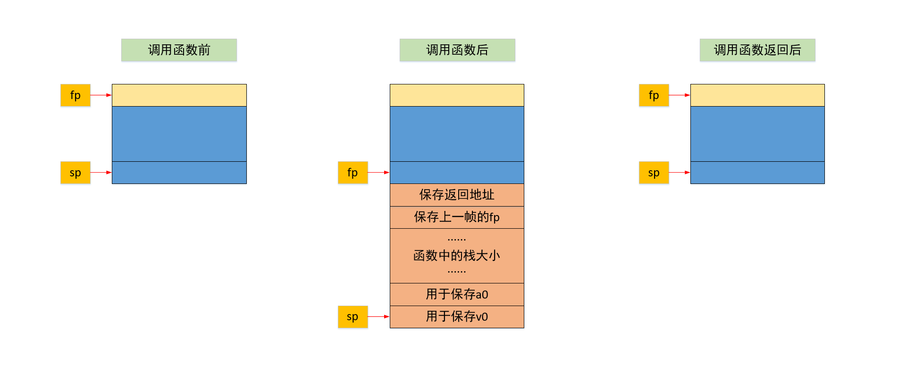

## 5. Kanga2Mips

+ [总目录](../README.md)

---

[TOC]

### 5.1 主要工作

+ 将符合 `kanga` 规范的代码转化为 `mips` 代码

+ `mips` 的 `BNF` 见 [网站](http://compilers.cs.ucla.edu/cs132/project/mips.html)
    + 但是实际上比较复杂，我们在翻译的过程主要参考 `ucla` 上的 `BubbleSort.s`
+ `mips` 特点
    + 需要显示操作栈
    + 栈指针 `fp,sp`

+ 主要工作就是准确计算出具体操作的栈的位置

### 5.2 方法与设计

#### 5.2.1 生成语法树类文件和词法语法分析器

+ 使用 `JAVACC` 和 `JTB`

```shell
java -jar jtb132.jar kanga.jj
java javacc jtb.out.jj
```

#### 5.2.2 类设计

+ 基本上一个 `kanga` 语句对应一个或者几个 `mips` 语句
+ 所以没有比较复杂的类，返回值都采用简单的 `String`

##### 5.2.2.1 visitor

###### Kanga2Mips

+ 生成 `mips` 代码

```java
public class Kanga2Mips
    extends visitor.GJNoArguDepthFirst<String>{······}
```

##### 5.2.2.2 其他类

###### Global

+ 一些全局函数，主要就是将代码规整化

### 5.3 实现思路

+ 基本上是逐句翻译，每一句有唯一对应的 `mips` 代码

+ 需要定义一些辅助函数 `_print,_halloc`
+ 在进行系统调用的时候需要进行是否需要保存 `a0,v0`
    + 在 `ucla` 的测试样例中，我们不进行这一步的考虑也能过
    + 但是在自己使用  `spiglet2kanga`  生成的代码中，不考虑会报错
    + `_print` 需要保存 `a0v0`
    + `_halloc` 需要进行判断
        + `MOVE r1 HALLOCATE SimpleExp`
        + 若 `r1` 为 `a0` 则不保存 `a0`
        + 若 `r1` 为 `v0` 则不保存 `v0`
+ 尝试大量使用语法树中的结构，删除不需要的 `accept`，尝试不使用返回值
    + 现在只在 `SimpleExp` 中使用到了返回值
+ 最后分析下**栈帧**，需要实现如下效果（不同颜色表示不同栈帧）
    + 在进入函数的时候
        + 保存返回地址和 `fp`
        + 然后开栈，函数中的栈大小指的就是 `kanga` 代码中的第 `2` 个参数
        + 需要多开 `4` 个单位的栈空间
    + 退出函数时，通过保存的返回地址和 `fp` 恢复即可




### 5.4 具体实现

#### Kanga2Mips

##### Goal

+ 需要实现辅助函数的定义
+  `main` 函数的生成
    + 栈空间大小的计算
        + `Proc[a][b][c]`
        + `(b+4)*4`
        + `a>4` ，那么这一部分已经包含在 `b` 中了
        + `c>4` ，那么这一部分也是出现在下一个栈帧的里面

```java
public String visit(Goal n) {
    // 生成辅助函数
    this.addHelperFunc();
    String _ret = null;
    this.procedureName = "main";
    // 计算栈空间的大小
    this.calcStackSize(
        Integer.parseInt(n.f2.f0.tokenImage),
        Integer.parseInt(n.f5.f0.tokenImage),
        Integer.parseInt(n.f8.f0.tokenImage)
    );
    // 添加函数头(保存返回地址和fp)
    this.addProcedureHead();
    n.f10.accept(this);
    // 添加函数尾部(恢复返回地址和fp)
    this.addProcedureTail();
    n.f12.accept(this);
    return _ret;
}
```

```java
// 生成辅助函数
private void addHelperFunc() {
    Global.outputString +=
        ".text\n"
        + ".globl _halloc\n"
        + "_halloc:\n"
        + "li $v0, 9\n"
        + "syscall\n"
        + "j $ra\n"
        + ".text\n"
        + ".globl _print\n"
        + "_print:\n"
        + "li $v0, 1\n"
        + "syscall\n"
        + "la $a0, newl\n"
        + "li $v0, 4\n"
        + "syscall\n"
        + "j $ra\n"
        + ".data\n"
        + ".align 0\n"
        + "newl:.asciiz \"\\n\"\n"
        + ".data\n"
        + ".align 0\n"
        + "str_er:.asciiz \"ERROR : abnormal termination\\n\"\n";
}
```

##### ErrorStmt

+ 系统调用 `syscall 10`

```java
public String visit(ErrorStmt n) {
    String _ret = null;
    // 不需要保存 v0,a0 反正也回不去了
    Global.outputString +=
        "li $v0, 4\n"
        + "la $a0, str_er\n"
        + "syscall\n"
        + "li $v0, 10\n" // exit(BS)
        + "syscall\n";
    return _ret;
}
```

##### CJumpStmt

+ `CJUMP Reg Label => beqz reg label`

```java
public String visit(CJumpStmt n) {
    String _ret = null;
    Global.outputString += "beqz $"
        + this.reg[n.f1.f0.which] + ", "
        + n.f2.f0.tokenImage + '\n';
    return _ret;
}
```

##### MoveStmt

+ 需要分类讨论，用到了不一样的寄存器指令

```java
public String visit(MoveStmt n) {
    String _ret = null;
    String r1 = this.reg[n.f1.f0.which];
    int which = n.f2.f0.which;
    if(which == 0) {
        /* 0 MOVE r1 HALLOCATE SimpleExp */
        this.save_a0v0(r1);
        n.f2.accept(this);
        Global.outputString += "move $" + r1 + ", $v0\n";
        this.load_a0v0(r1);
    }
    else {
        /* 1 MOVE r1 Operator Reg SimpleExp */
        /* 2 MOVE r1 SimpleExp */
        this.moveReg = r1; // 向下传参
        n.f2.accept(this);
        this.moveReg = null;
    }
    return _ret;
}
```

##### PrintStmt

+ 保存 `a0,v0`

```java
public String visit(PrintStmt n) {
    String simpleExp = n.f1.accept(this);
    this.save_a0v0(null);
    Global.outputString +=
        "move $a0, " + simpleExp + '\n'
        + "jal _print\n";
    this.load_a0v0(null);
    return null;
}
```

##### AStoreStmt/ALoadStmt

+ 需要准确计算出在栈上的位置
+ `SPILLEDARG` 起始为 `0`，对应 `-12$(fp)`
    + `SPILLEDARG` 为 `x`
    + 偏移量为 `offset = (x+3)*4`
    + 栈上位置 `-offset$(fp)`

```java
public String visit(AStoreStmt n) {
    String r1 = this.reg[n.f2.f0.which];
    int offset = Integer.parseInt(n.f1.f1.f0.tokenImage);
    Global.outputString += "sw $" + r1 + ", -" + ((offset+3)*4) + "($fp)\n";
    return null;
}
```

##### PassArgStmt

+ 直接传递到下一个栈帧
+ 需要准确计算具体的位置
+ `PASSARG` 起始为 `1`，对应 `-12$(sp)`
    + `PASSARG` 为 `x`
    + 偏移量为 `offset = (x+2)*4`
    + 栈上位置 `-offset$(sp)`

```java
public String visit(PassArgStmt n) {
    // 直接将参数保存到下一个栈帧
    int offset = Integer.parseInt(n.f1.f0.tokenImage);
    String r1 = this.reg[n.f2.f0.which];
    Global.outputString += "sw $" + r1 + ", -" + ((offset+2)*4) + "($sp)\n";
    return null;
}
```

##### CallStmt

+ 需要判断一下使用 `jalr/jal` 指令

```java
public String visit(CallStmt n) {
    String simpleExp = n.f1.accept(this);
    // 判断一下是寄存器还是Label
    if(simpleExp.charAt(0) == '$')
        Global.outputString += "jalr " + simpleExp + '\n';
    else
        Global.outputString += "jal " + simpleExp + '\n';
    return null;
}
```

##### SimpleExp

+ 需要判断一下使用哪一个指令 `move/li/la`

```java
public String visit(SimpleExp n) {
    int which = n.f0.which;
    String t;
    if(which == 0) t = '$' + this.reg[((Reg)(n.f0.choice)).f0.which];
    else if(which == 1) t = ((IntegerLiteral)(n.f0.choice)).f0.tokenImage;
    else t = ((Label)(n.f0.choice)).f0.tokenImage;
    if(this.moveReg != null) {
        if(which == 0)
            Global.outputString += "move $" + this.moveReg + ", " + t + '\n';
        else if(which == 1)
            Global.outputString += "li $" + this.moveReg + ", " + t + '\n';
        else
            Global.outputString += "la $" + this.moveReg + ", " + t + '\n';
        this.moveReg = null; // 用完即删
    }
    return t;
}
```

##### Label

+ 这里只输出最前面的标号，即在 `JUMP L1` 类似的标号不输出
+ 使用屏蔽实现

```java
public String visit(Label n) {
    // 注意进入这里的只会有开头的标识 Label
    // 屏蔽 Procedure/CJUMP/JUMP/SimpleExp
    String _ret = null;
    Global.outputString += n.f0.tokenImage + ":";
    return _ret;
}
```

#### Global

##### normOfOutputString

+ 将函数声明、标号直接左边不留空，其余空 `8` 个空格
+ 操作了下，将带标号的语句除标号外也是也是从第 `9` 个字符位置开始
    + 标号长度大于 `8` 时就没处理，情况较少

```java
/** 将输出规范化 */
public static void normOfOutputString() {
    Global.outputString = Global.outputString.replaceAll("  ", " ");
    Global.outputString = Global.outputString.replaceAll("  ", " ");
    String[] seg = Global.outputString.split("\n");
    String _ret = "";
    for(String x : seg) {
        String temp = x.trim();
        // 空行
        if(temp.equals("")) continue;
        if(temp.equals(".text") || temp.equals(".data")) {
            _ret += '\n';
        }
        // 检查是否为函数声明
        // TODO 可能是字符串中含有":"
        int indexOfColon = temp.indexOf(':');
        if(indexOfColon != -1) {
            // 是否为 Label
            boolean isLabel = temp.charAt(temp.length() - 1) != ':';
            if(isLabel) {
                if(indexOfColon >= Global.blankLength) _ret += temp;
                else _ret += temp.substring(0, indexOfColon + 1)
                    + Global.blank.substring(indexOfColon + 1)
                    + temp.substring(indexOfColon + 1).trim();
            }
            else {
                _ret +=  temp;
            }
        }
        else {
            _ret += Global.blank + temp;
        }
        _ret += '\n';
    }
    Global.outputString = _ret;
}
```

