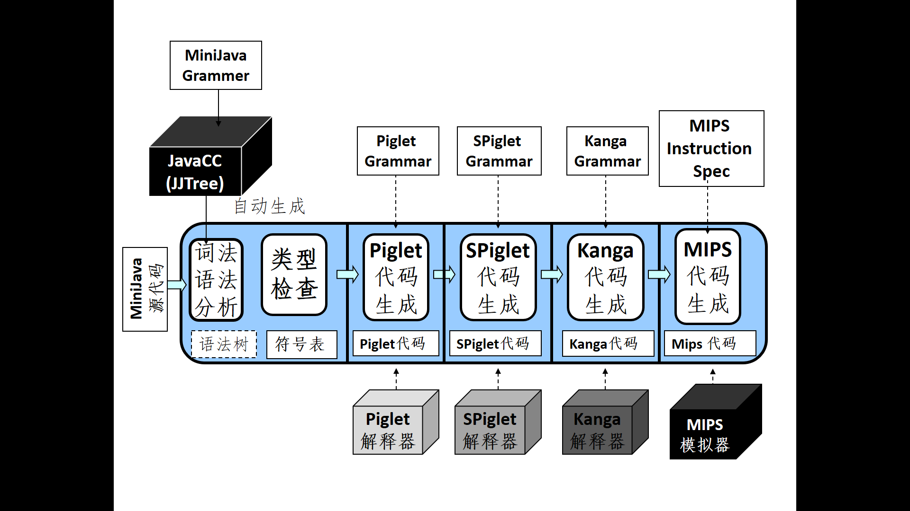

# 编译实习报告 minijava2mips

>**@author banbao**

[TOC]

## 0 介绍

### 0.1 项目简介

+ [项目地址](http://web.cs.ucla.edu/~palsberg/course/cs132/project.html)
+ 本项目的目标是使用 `java` 语言编写一个将 `minijava` 源程序转化为 `mips` 代码
+ 整个项目主要分为以下 `5` 个部分
    + `TypeChecker`
        + 检验输入的 `minijava` 代码是否符合 `minijava` 的语义规范
        + `minijava` 是 `java` 的一个子集，保留了类特征
    + `minijava2piglet`
        + 将符合 `minijava` 语义规范的 `minijava` 源代码转化为 `piglet` 中间代码
        + `piglet` 语法没有类的概念，没有数组的概念，需要自己维护
    + `piglet2spiglet`
        + 将符合 `piglet` 语义规范的 `piglet` 源代码转化为 `spiglet` 中间代码
        + `spiglet` 是 `piglet` 的一个子集，没有了 `piglet` 中的复合语句的概念
    + `spiglet2kanga`
        + 将符合 `spiglet` 语义规范的 `spiglet` 源代码转化为 `kanga` 中间代码
        + `kanga` 语言使用有限的寄存器，转换过程中需要实现寄存器的分配
    + `kanga2mips`
        + 将符合 `kanga` 语义规范的 `kanga` 源代码转化为 `mips` 代码
        + `mips` 语言需要显式操作栈，需要自己维护运行时栈
+ 具体流程如下图所示（来自课件）

### 0.2 设计模式与辅助工具

+ 设计模式使用 `visitor-accept` 模式，方便与代码的重构与修改
+ 辅助工具有 `JAVACC` 和 `JTB`
    + `JTB:Java Tree Builder`
        + 用于生成语法树类文件
        +  http://compilers.cs.ucla.edu/jtb/
    + `JAVACC:Java Compiler Compiler`
        +  可以生成词法和语法分析器
        +  https://javacc.github.io/javacc/

### 0.3 目录

+ [Project01 - TypeChecker](Project01/README.md)
+ [Project02 - MiniJava2Piglet](Project02/README.md)
+ [Project03 - Piglet2Spiglet](Project03/README.md)
+ [Project04 - Spiglet2Kanga](Project04/README.md)
+ [Project05 - Kanga2Mips](Project05/README.md)
+ [Conclusion](README-Conclusion.md)

